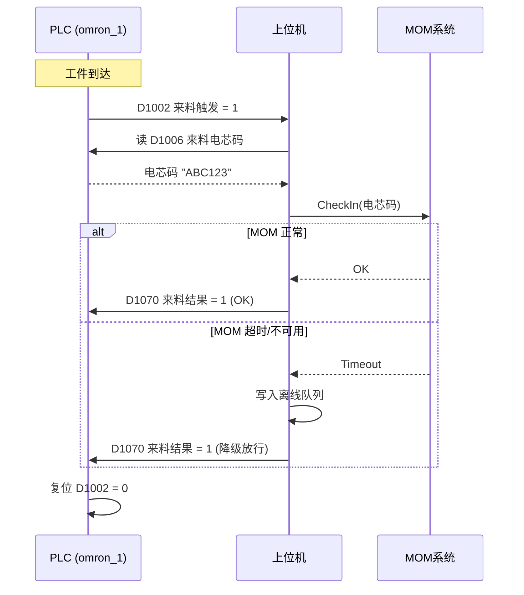
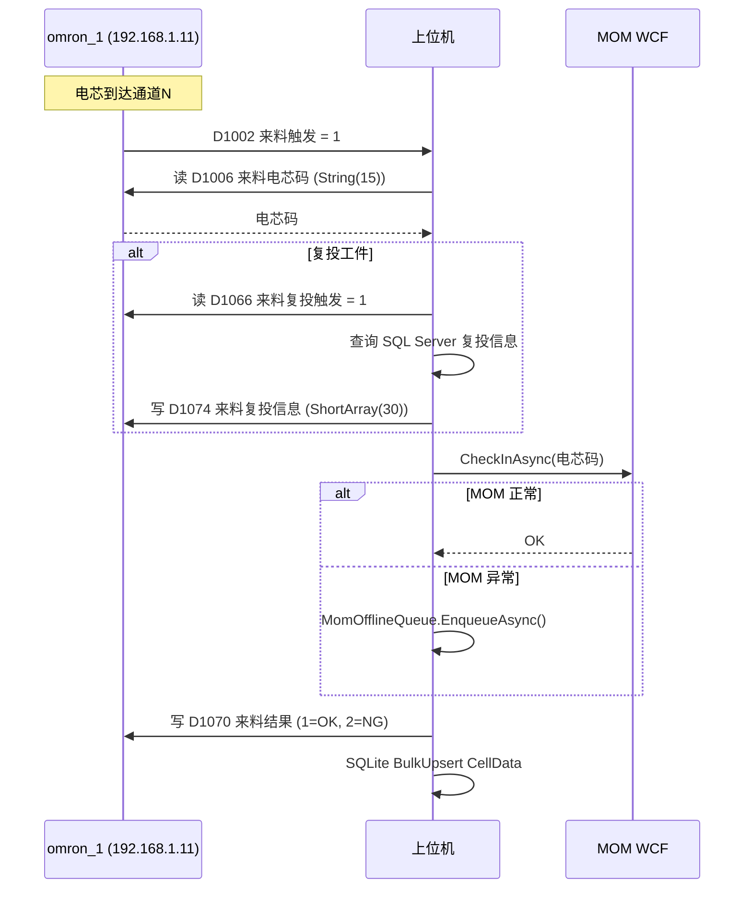
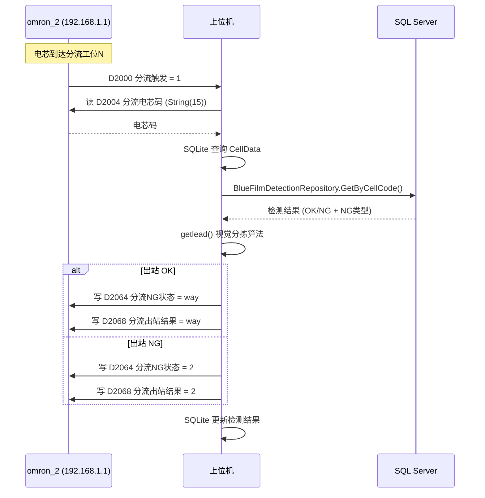

# ELECTRICAL.md — 上位机-PLC 对接开发规范

泛用架构模式与开发模板。适用于任何 PLC 品牌和项目，当前项目作为参考实现（附录 A）。

---

## §1 架构模式

### 三层抽象

```
┌─────────────────────────────────────────────────┐
│ PlcMonitor (顶层管理器)                          │
│ · 加载 JSON/CSV 配置                             │
│ · 创建 PlcChannel 列表                           │
│ · 暴露 TryGetLatestByName / ReadOnceByNameAsync  │
│   / WriteByNameAsync — 按信号名读写，不接触地址    │
└──────────┬──────────────────┬───────────────────┘
           │                  │
     ┌─────▼─────┐      ┌─────▼─────┐
     │PlcChannel 1│      │PlcChannel 2│  (一 PLC 一通道)
     │· 连接-轮询  │      │· 连接-轮询  │
     │· 重连循环   │      │· 重连循环   │
     │· 信号值缓存 │      │· 信号值缓存 │
     │· Rx Subject │      │· Rx Subject │
     └─────┬──────┘      └─────┬──────┘
           │                  │
     ┌─────▼──────────────────▼───────────────────┐
     │ IPlcConnection (品牌无关接口)                │
     │ · Connect() / Disconnect()                  │
     │ · Read<T>(address) / Write(address, data)   │
     │ · IsConnected                               │
     │                                             │
     │ 实现: OmronConnection / SiemensConnection    │
     │       / ModbusConnection / ...              │
     └─────────────────────────────────────────────┘
```

### 设计原则

- **配置驱动**: PLC IP、端口、信号定义全部通过 JSON/CSV 文件管理，不硬编码
- **按名称访问**: 业务代码使用信号名（如 `"PLC通道1来料触发"`），不接触地址字符串
- **信号值缓存**: `ConcurrentDictionary<string, object>` 常驻最新值，业务代码读缓存不触发 I/O
- **推送模式**: 信号更新通过 `System.Reactive.Subject<SignalUpdate>` 推送给订阅者（如 UI 监控面板）
- **指数退避重连**: base 500ms, max 30s, 最多 10 次重试

### 配套组件

| 组件 | 职责 |
|------|------|
| `PlcConnectionFactory` | 根据 `PlcConfig.Brand` 枚举创建对应 `IPlcConnection` |
| `SignalReader` | 根据 `SignalData.DataType` 分发到类型化读方法 |
| `RetryPolicy` | 指数退避计时器，提供 `NextDelay()` 和 `Reset()` |
| `PlcConfigService` | 读写 `plc_config.json` + `signals_config.csv` |

---

## §2 信号定义规范

### CSV 格式 (signals_config.csv)

7 列，UTF-8 编码：

| 列 | 含义 | 示例 | 说明 |
|----|------|------|------|
| Address | PLC 地址 | D1002 | 品牌相关，见 §5 |
| DataType | 数据类型 | UShort | 见下方类型映射表 |
| Name | 信号名 | PLC通道1来料触发 | 中文，命名规范见下 |
| Description | 用途说明 | 来料工位触发信号，PLC→PC，1=有料 | 自由文本 |
| PlcId | 所属 PLC | omron_1 | 对应 plc_config.json 中的 Id |
| Direction | 读写方向 | R | R=PLC→PC(读), W=PC→PLC(写), RW=双向 |
| Group | 功能分组 | 来料 | 便于分类索引 |

### 命名规范

```
PLC通道{N}{功能}{动作}
PLC通道1来料触发      → 通道1，来料工位，触发信号
PLC通道1来料电芯码    → 通道1，来料工位，电芯码数据
PLC通道1来料结果      → 通道1，来料工位，结果回写
PLC通道2分流触发      → 通道2，分流工位，触发信号
PLC心跳获取           → 全局，心跳读取
出站心跳              → 全局，出站心跳写入
```

非通道类信号（心跳、视觉同步等）不套用通道格式，直接用功能名。

### 数据类型映射

| CSV DataType | C# 类型 | 字节数 | 说明 |
|--------------|---------|--------|------|
| Bool | bool | 1 | 位信号 |
| UShort | ushort | 2 | 无符号短整，PLC 中最常用 |
| Short | short | 2 | 有符号短整 |
| Int | int | 4 | 32 位整数 |
| UInt | uint | 4 | 无符号 32 位 |
| Long | long | 8 | 64 位整数 |
| Float | float | 4 | 单精度浮点 |
| Double | double | 8 | 双精度浮点 |
| String(n) | string | n | 定长字符串，n=字节数 |
| ShortArray(n) | short[] | n×2 | 短整数组，n=元素个数 |
| ByteArray(n) | byte[] | n | 字节数组 |

### 地址编码规则（按品牌）

| 品牌 | 地址格式 | 示例 |
|------|---------|------|
| Omron | D区(Dxxxx) / W区(Wxxxx) | D1000, W200 |
| Siemens | DBx.DBWy | DB1.DBW0 |
| Modbus | 区号+偏移 | 40001 (保持寄存器) |
| Mitsubishi | Dxxxx / Mxxxx | D100 (字), M0 (位) |

---

## §3 时序流程图规范

### 使用 Mermaid sequenceDiagram

每个工位画一张时序图，表达 PLC ↔ PC ↔ 外部系统的交互。模板：



### 规范要点

- Participant 行标注真实名称和 IP
- PLC 信号标注地址别名，如 `D1002 (来料触发)`
- 异常分支用 `alt/else/end` 块
- 超时/重试用 `Note` 标注具体数值
- PC 调用外部服务（MOM/数据库）单独画出
- 涉及的所有信号汇总在流程图下方

---

## §4 工位状态机

### IStationHandler 接口

```csharp
public interface IStationHandler
{
    /// <summary>检查通道心跳，失败时抛异常暂停工站</summary>
    Task<bool> CheckHeartbeatAsync(CancellationToken token);

    /// <summary>等待触发信号，超时返回 false</summary>
    Task<bool> WaitForSignalAsync(CancellationToken token);

    /// <summary>执行业务逻辑，写结果回 PLC</summary>
    Task ExecuteActionAsync(CancellationToken token);
}
```

### Station 循环

```
┌─────────────────────────────────────────┐
│ while (!token.IsCancelled)              │
│   if (全局心跳丢失) → delay 1s, continue │
│   await handler.CheckHeartbeatAsync()   │
│   await handler.WaitForSignalAsync()    │
│   await handler.ExecuteActionAsync()    │
└─────────────────────────────────────────┘
```

### 全局心跳机制

- **GlobalHeartbeatState**: `Healthy → Lost → Recovering → Healthy`
- 心跳丢失条件: 任一 PLC 连接断开 或 心跳值超过 N 秒未变化
- Lost 时所有 Station 暂停（通过共享 `_globalPaused` 标志）
- Recovering: 心跳恢复后等待 2 秒确认稳定，再切回 Healthy

### 多通道扩展

- 每个物理通道（Channel 1-4）创建一组 Station: `{来料Station, 分流Station}`
- 每 Station 独立 `Task.Run`，通过 `CancellationTokenSource` 统一启停
- 来料 Station 只读 omron_1 信号，分流 Station 只读 omron_2 信号

---

## §5 品牌适配

### 连接参数模板

**Omron FINS**:
```json
{ "brand": "Omron", "ipAddress": "192.168.1.11", "port": 9600,
  "settings": { "sa1": 247, "da1": 1 } }
```

**Siemens S7-1200/1500**:
```json
{ "brand": "Siemens", "ipAddress": "192.168.1.10", "port": 102,
  "settings": { "rack": 0, "slot": 1 } }
```

**Modbus TCP**:
```json
{ "brand": "ModbusTcp", "ipAddress": "192.168.1.10", "port": 502,
  "settings": { "stationId": 1 } }
```

**Mitsubishi Melsec**:
```json
{ "brand": "Mitsubishi", "ipAddress": "192.168.1.10", "port": 6000,
  "settings": { "isBinary": true } }
```

### 已知限制

| 品牌 | 限制 |
|------|------|
| Omron | 字符串需指定长度，FINS 节点号不能冲突 |
| Siemens | S7-1200 需在 TIA Portal 中启用 PUT/GET 访问 |
| Modbus | 数组读取在某些实现中不支持 |
| Mitsubishi | 二进制/ASCII 模式需与 PLC 端一致，数组读取待实现 |

---

## §6 模拟与测试

### 模拟模式

`App.config` 中 `SimulationMode=true` 时：
- `SimulationDataGenerator` 周期性生成假 CellData 写入 SQLite
- 模拟数据电芯码以 `SIM` 前缀标识
- PLC 读写可跳过（需在代码中检查该开关）

### 本地测试 PLC 配置

使用 `127.0.0.1` 配合软 PLC 或模拟器：
```json
{ "id": "omron_local_1", "brand": "Omron",
  "ipAddress": "127.0.0.1", "port": 9600 }
```

### 无硬件调试

- PlcChannel 连接失败时不崩溃，进入重连循环
- `TryGetLatestByName` 返回缓存的最后值或 default
- `ReadOnceByNameAsync` 连接失败时抛出明确异常，调用方决定降级策略

### 单元测试策略

| 测试对象 | 方式 |
|----------|------|
| SignalReader 类型分发 | 注入 Mock IPlcConnection，验证各类型 Read<T> 调用 |
| PlcChannel 重连逻辑 | Mock IPlcConnection 模拟连接断开，验证重试次数和间隔 |
| Station 状态流转 | 注入 Mock IStationHandler，验证循环逻辑 |
| 配置加载 | 提供测试用 JSON/CSV，验证解析结果 |

---

## §7 故障排查

### 分层诊断

**L1 — 物理层**:
```bash
ping 192.168.1.11        # 检查网络可达
telnet 192.168.1.11 9600 # 检查端口开放
```
- 不通: 检查网线、交换机、IP 配置、防火墙

**L2 — 连接层**:
- 查看 `PlcChannel.ConnectionState`（Disconnected/Connecting/Connected/Reconnecting/Faulted）
- 查看日志中的连接错误和重试记录
- 常见原因: IP/端口配错、PLC 未开机、FINS 节点号冲突

**L3 — 心跳层**:
- 用 `TryGetLatestByName("PLC心跳获取")` 读取心跳值
- 确认值在 0 和 1 之间周期性变化
- 不变: 检查 PC 是否正确写入 `PLC心跳响应`（toggle 0/1）

**L4 — 信号层**:
- `ReadOnceByNameAsync("怀疑的信号名")` 单次读取
- 对比 CSV 中的地址和类型是否正确
- 用 PLC 编程软件（如 CX-Programmer）在线监控确认值

**L5 — 逻辑层**:
- 查看工位 `StationState`（Idle/Waiting/Processing/Error）
- 查看 Rlog 日志中对应通道的进入/退出记录
- 常见问题: 触发后未复位、结果值写错、外部服务超时

### 常见问题速查

| 现象 | 可能原因 | 检查项 |
|------|---------|--------|
| 所有工站停摆 | 全局心跳丢失 | 检查 PLC 连接状态，ping 测试 |
| 某通道不触发 | 触发信号未到位 | PLC 在线监控 D1002-D1005 值 |
| 扫码无反应 | 扫码枪未触发或电芯码寄存器未更新 | 检查 Scan() 是否调用，D1006 值 |
| MOM 查单失败 | 网络不通或服务不可用 | MomCircuitBreaker 状态，离线队列 |
| 分流不动作 | 检测结果未查询到 | SQL Server 连接，BlueFilmDetection 表 |

---

## 附录 A: 本项目参考实现

### A.1 PLC 拓扑

| PLC ID | 品牌 | IP | 端口 | 职责 |
|--------|------|----|------|------|
| omron_1 | Omron | 192.168.1.11 | 9600 | 来料侧: 4通道触发/扫码/复投 |
| omron_2 | Omron | 192.168.1.1 | 9600 | 出站侧: 4通道分流/NG/清洗/视觉同步 |

### A.2 来料流程 (Mermaid)



### A.3 分流流程 (Mermaid)



### A.4 信号统计

- 来料侧 (omron_1): 23 个信号 (D1000-D1164)
- 出站侧 (omron_2): 27 个信号 (D2000-D2118)
- 合计: 50 个信号
- 信号配置文件: `辅助工程/PLCHandler/Config/signals_config.csv`
- PLC 配置文件: `辅助工程/PLCHandler/Config/plc_config.json`

### A.5 工位分配

| 通道 | 来料 Station | 分流 Station |
|------|-------------|-------------|
| 1 | ProductArriveStationHandler(owner, 1) | ProductLeadStationHandler(owner, 1) |
| 2 | ProductArriveStationHandler(owner, 2) | ProductLeadStationHandler(owner, 2) |
| 3 | ProductArriveStationHandler(owner, 3) | ProductLeadStationHandler(owner, 3) |
| 4 | ProductArriveStationHandler(owner, 4) | ProductLeadStationHandler(owner, 4) |
